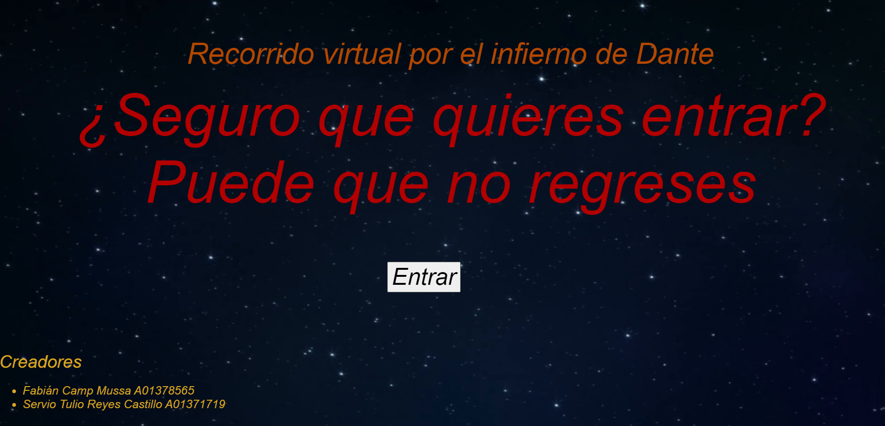
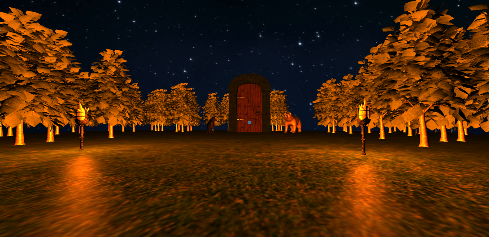
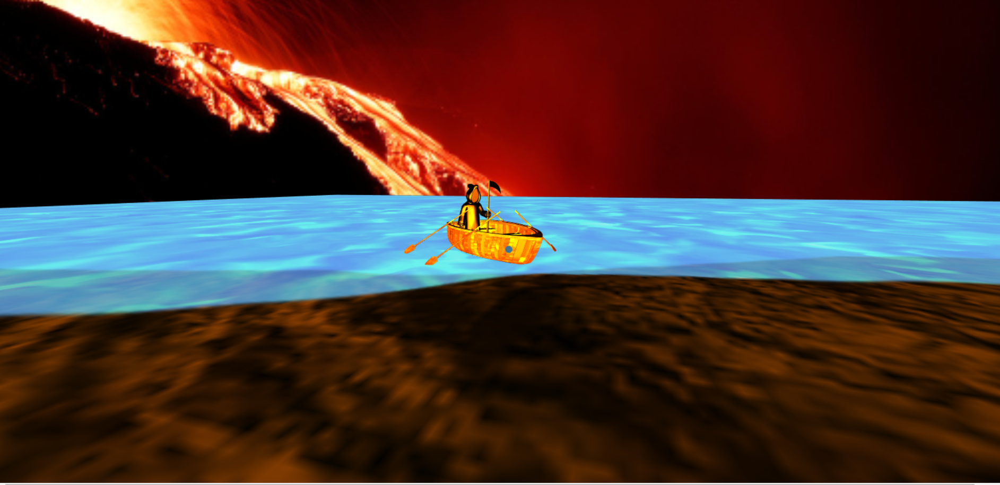
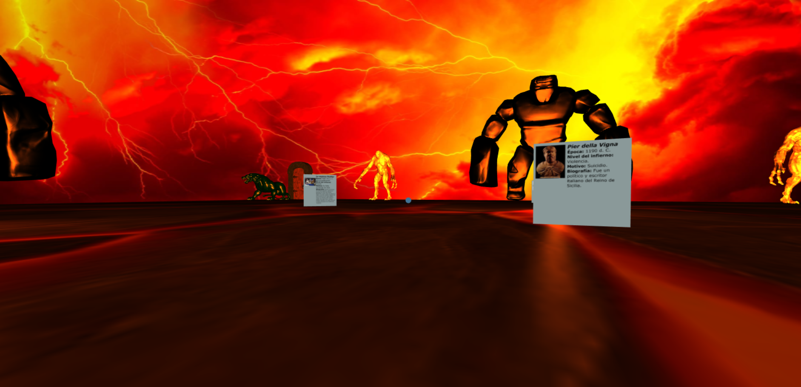
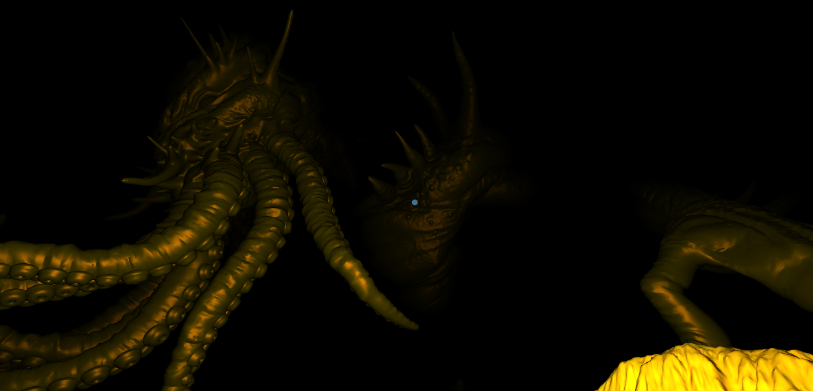
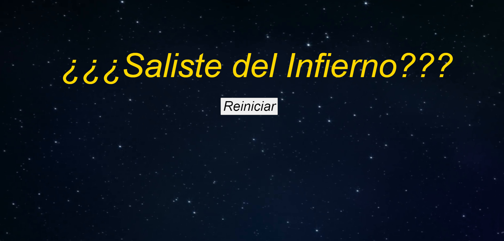

# DantesInferno

## Project General Description
This project is a virtual tour using [Three.js](https://threejs.org/) from the [Inferno](https://en.wikipedia.org/wiki/Inferno_(Dante)) described by [Dante Alighieri](https://en.wikipedia.org/wiki/Dante_Alighieri).

### Authors
- Fabián Camp Mussa A01378565
- Servio Tulio Reyes Castillo A01371719

## Scenes

Clicking over the file `startPage.html` will start your journey.

### Initial Scene

This scene contains a disclaimer to our travelers and the full name from the developers.

### Door Scene

Scene with the visualization of the hell gate.

### Caronte Scene

Caronte taking you to the first level.

### Cerberus Scene

Cerberus protecting the next level.

### Ice Scene

Scape as fast as you can!

### Final Scene

Do you really want to try again?

## Notes
- This repo contains several large files, so it used GitHub's LFS. After "normal" pulling (`git pull`) the lfs extension in git should be enabled (review the following link https://git-lfs.github.com/) and you need to input the command `git lfs pull`
- This project only works if you mount it in a local server. 
- This a non profit project.
